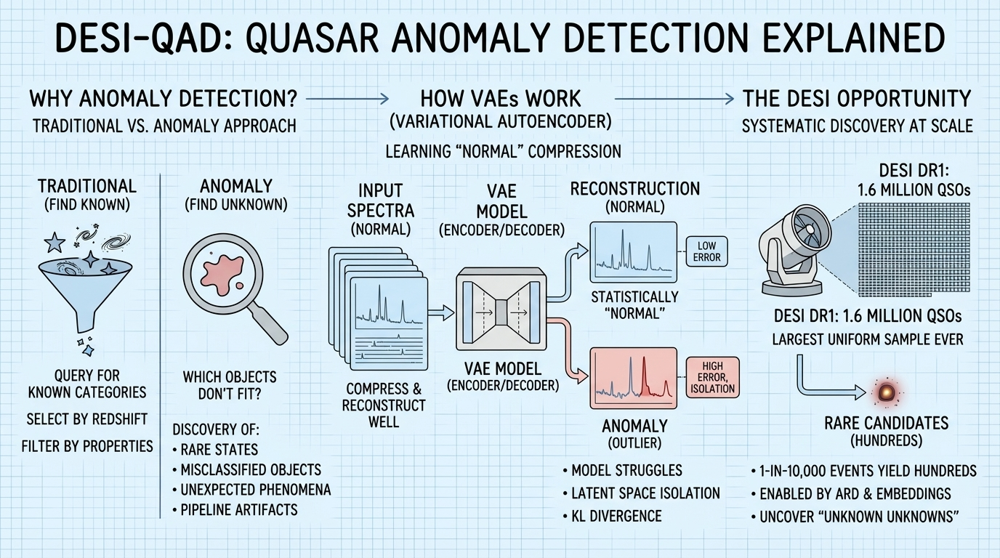
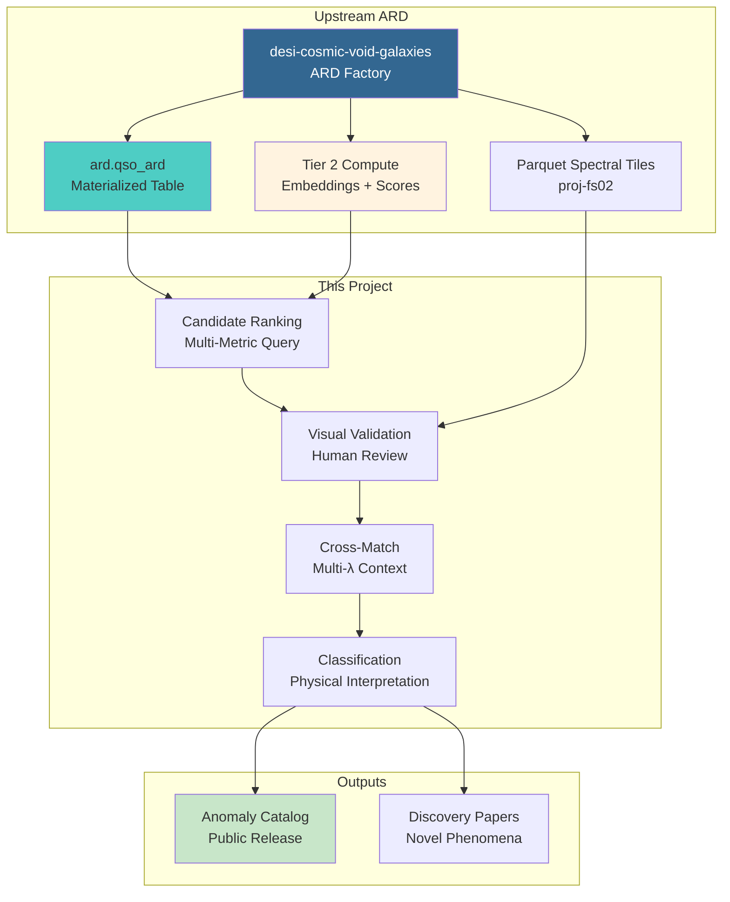

<!--
---
title: "DESI QSO Anomaly Detection"
description: "ML-driven discovery of anomalous quasars in DESI DR1 spectra"
author: "VintageDon"
date: "2025-12-29"
version: "2.0"
status: "Skeletal"
tags:
  - type: project-root
  - domain: [ard-consumer, anomaly-detection, machine-learning]
  - tech: [python, pytorch, postgresql, desi]
related_documents:
  - "[DESI Cosmic Void Galaxies (ARD Provider)](https://github.com/radioastronomyio/desi-cosmic-void-galaxies)"
  - "[Quasar Outflows](https://github.com/radioastronomyio/desi-quasar-outflows)"
---
-->

# 🔍 DESI QSO Anomaly Detection

[](https://data.desi.lbl.gov/doc/releases/dr1/)
[](https://www.postgresql.org/)
[](https://www.python.org/)
[](https://pytorch.org/)
[](LICENSE)
[]()


> Systematic discovery of statistically anomalous quasar spectra in DESI DR1 using unsupervised machine learning.

This project consumes the Analysis-Ready Dataset (ARD) built by [desi-cosmic-void-galaxies](https://github.com/radioastronomyio/desi-cosmic-void-galaxies) to perform large-scale anomaly detection across ~1.6 million QSO spectra. Using a Variational Autoencoder architecture, the goal is to systematically identify rare physical states, unknown object classes, and unexpected phenomena that would be missed by traditional catalog queries.

Current Status: Skeletal — repository structure established, awaiting ARD completion (Phase 05-06 in upstream project).

---

## 🔭 Background

This section provides context for those less familiar with spectral anomaly detection. If you already know autoencoders and outlier detection, skip to [Data Dependencies](#-data-dependencies).



### Why Anomaly Detection?

Traditional astronomical analysis starts with known categories: we query for quasars, select by redshift, filter by emission line properties. This approach is powerful but inherently limited — it only finds what we already know to look for.

Anomaly detection inverts this: instead of asking "which objects match my criteria?", we ask "which objects don't fit the normal pattern?" This enables discovery of:

- Rare physical states: Changing-look quasars mid-transition, extreme BAL systems
- Misclassified objects: Sources incorrectly labeled as QSOs that represent something else entirely
- Unexpected phenomena: Novel spectral signatures not yet cataloged in the literature
- Pipeline artifacts: Systematic data reduction issues worth feeding back to the collaboration

### How Does It Work?

A Variational Autoencoder (VAE) learns to compress spectra into a low-dimensional latent space and reconstruct them. Most spectra compress and reconstruct well — they're "normal" in the statistical sense. Anomalies are spectra the model struggles with:

- High reconstruction error: The output doesn't match the input
- Latent space isolation: The compressed representation is far from other objects
- KL divergence: The encoding doesn't fit the learned distribution

By combining these metrics, we identify spectra that warrant human inspection — the "unknown unknowns" hiding in 1.6 million objects.

### The DESI Opportunity

DESI DR1 is the largest uniform spectroscopic QSO sample ever assembled. The sheer scale means rare phenomena (1-in-10,000 events) still yield hundreds of candidates. Combined with the ARD's pre-computed properties and spectral embeddings, this enables systematic discovery at unprecedented scale.

---

## 📦 Data Dependencies

This project is an ARD consumer — it does not perform primary data ingestion. All catalog data and spectral embeddings come from the upstream ARD factory.

### Upstream Provider

| Source | Repository | What We Use |
|--------|------------|-------------|
| DESI DR1 ARD | [desi-cosmic-void-galaxies](https://github.com/radioastronomyio/desi-cosmic-void-galaxies) | QSO catalog + spectral embeddings |

### Required ARD Columns

| Column | Source | Purpose |
|--------|--------|---------|
| TARGETID | DESI Core | Object identifier |
| Z_HELIO | DESI Core | Redshift for rest-frame transformation |
| SPECTYPE | DESI Core | QSO selection |
| BAL_PROB | AGN VAC | Known BAL flagging |
| LATENT_VEC | Tier 2 compute | 16-D spectral embedding |
| RECON_MSE | Tier 2 compute | Reconstruction error |
| ANOMALY_SCORE | Tier 2 compute | Isolation Forest score |

### Spectral Data

| Asset | Location | Purpose |
|-------|----------|---------|
| QSO Parquet tiles | proj-fs02 network share | Raw spectra for validation |
| Linkage index | PostgreSQL (proj-pg01) | TARGETID → tile mapping |

Note: The core ML metrics (LATENT_VEC, RECON_MSE, ANOMALY_SCORE) are computed upstream as Tier 2 ARD columns. This project focuses on candidate validation and scientific interpretation rather than model training.

---

## 🔬 Methodology Overview

The analysis leverages pre-computed embeddings from the ARD, focusing on candidate triage and scientific follow-up.

### Phase 1: Candidate Ranking

Query the ARD for high-anomaly objects:

```sql
SELECT targetid, z_helio, recon_mse, anomaly_score, bal_prob
FROM ard.qso_ard
WHERE anomaly_score > threshold
ORDER BY anomaly_score DESC
```

Apply multi-metric filtering:

- Reconstruction error above population threshold
- Latent space isolation (Isolation Forest)
- Exclude known BAL systems (or flag for separate analysis)

### Phase 2: Visual Validation

For top candidates:

- Retrieve spectra from Parquet tiles
- Generate diagnostic plots (spectrum, reconstruction, residuals)
- Human classification: genuine anomaly vs artifact vs known phenomenon

### Phase 3: Cross-Match & Context

For validated anomalies:

- Multi-wavelength cross-match (WISE, GALEX, X-ray catalogs)
- Literature search for prior observations
- Physical interpretation and categorization

### Phase 4: Catalog & Publication

- Curated anomaly catalog with classifications
- Discovery papers for novel phenomena
- Public release as community resource

---

## 🏗️ Architecture



---

## 🚀 Project Status

| Phase | Name | Status | Blocker |
|-------|------|--------|---------|
| — | Repository Setup | ✅ Complete | — |
| — | ARD Dependency | ⏳ Waiting | Upstream Phase 05-06 |
| — | Tier 2 Embeddings | ⏳ Waiting | Upstream Phase 07 |
| 01 | Candidate Ranking | ⬜ Not Started | Embeddings available |
| 02 | Visual Validation | ⬜ Not Started | Phase 01 |
| 03 | Cross-Match | ⬜ Not Started | Phase 02 |
| 04 | Catalog Release | ⬜ Not Started | Phase 03 |

### Prerequisites

Before work begins on this project:

1. ARD Phase 05-06 must complete — validates QSO catalog
2. ARD Phase 07 (Tier 2 compute) must generate spectral embeddings
3. LATENT_VEC, RECON_MSE, ANOMALY_SCORE columns must be populated

---

## 📁 Repository Structure

```markdown
desi-qso-anomaly-detection/
├── 📚 docs/                          # Documentation
│   ├── data-science-infrastructure.md
│   └── documentation-standards/
├── 🔬 src/                           # Source code (to be developed)
├── 🚀 scripts/                       # Analysis pipelines (to be developed)
├── 📊 notebooks/                     # Validation notebooks (to be developed)
├── 🌐 web/                           # Validation UI (to be developed)
├── 🧪 tests/                         # Unit tests (to be developed)
├── 📂 work-logs/                     # Milestone documentation
│   └── 01-ideation-and-setup/
├── 💾 data/                          # Local data cache (gitignored)
├── 🗒️ scratch/                       # Session checkpoints
└── 📝 README.md                      # This file
```

---

## 🖥️ Infrastructure

This project runs on the [Proxmox Astronomy Lab](https://github.com/radioastronomyio/proxmox-astronomy-lab) cluster.

| Resource | Node | Purpose |
|----------|------|---------|
| PostgreSQL 16 | proj-pg01 | ARD queries, candidate ranking |
| Spectral tiles | proj-fs02 | QSO spectra for validation |
| GPU compute | radio-gpu01 | Embedding inference (if needed locally) |
| Python processing | proj-dp01 | Validation pipeline |

---

## 🔗 Related Projects

### DESI Research Portfolio

| Project | Role | Status |
|---------|------|--------|
| [desi-cosmic-void-galaxies](https://github.com/radioastronomyio/desi-cosmic-void-galaxies) | ARD provider (upstream) | Active |
| [desi-quasar-outflows](https://github.com/radioastronomyio/desi-quasar-outflows) | Outflow energetics (consumer) | Skeletal |
| This repo | Anomaly detection (consumer) | Skeletal |

### External Resources

| Resource | Description |
|----------|-------------|
| [DESI DR1 Portal](https://data.desi.lbl.gov/doc/releases/dr1/) | Official data documentation |
| [Spender](https://github.com/pmelchior/spender) | Spectral autoencoder architecture |
| [AGN/QSO VAC](https://data.desi.lbl.gov/doc/releases/dr1/vac/agnqso/) | BAL flags and QSO properties |

---

## 📜 License

This project is licensed under the MIT License — see [LICENSE](LICENSE) for details.

---

## 🙏 Acknowledgments

- [DESI Collaboration](https://www.desi.lbl.gov/) — Data Release 1 public data
- Spender development team — Spectral embedding architecture
- AGN/QSO VAC team — BAL identification and QSO properties

---

Last Updated: December 29, 2025 | Status: Skeletal (Awaiting ARD + Embeddings)
