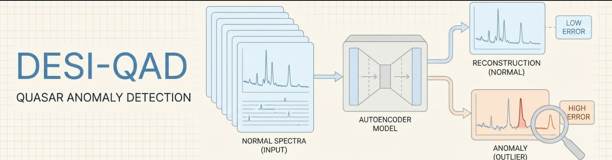
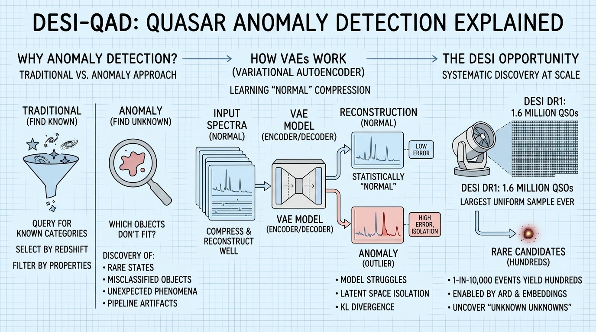
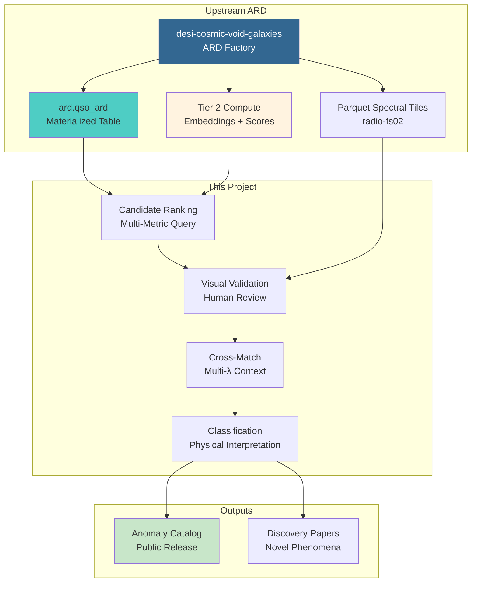

<!--
---
title: "DESI QSO Anomaly Detection"
description: "ML-driven discovery of anomalous quasars in DESI DR1 spectra"
author: "VintageDon"
date: "2026-03-29"
version: "2.1"
status: "Active"
tags:
  - type: project-root
  - domain: [ard-consumer, anomaly-detection, machine-learning]
  - tech: [python, pytorch, postgresql, desi]
related_documents:
  - "[DESI Cosmic Void Galaxies (ARD Provider)](https://github.com/radioastronomyio/desi-cosmic-void-galaxies)"
  - "[Quasar Outflows](https://github.com/radioastronomyio/desi-quasar-outflows)"
---
-->

# 🔍 DESI QSO Anomaly Detection

[](https://data.desi.lbl.gov/doc/releases/dr1/)
[](https://www.postgresql.org/)
[](https://www.python.org/)
[](https://pytorch.org/)
[](LICENSE)
[]()



> Systematic discovery of statistically anomalous quasar spectra in DESI DR1 using unsupervised machine learning.

This project consumes the Analysis-Ready Dataset (ARD) built by [desi-cosmic-void-galaxies](https://github.com/radioastronomyio/desi-cosmic-void-galaxies) to perform large-scale anomaly detection across ~1.6 million QSO spectra. Using a Variational Autoencoder architecture, the goal is to systematically identify rare physical states, unknown object classes, and unexpected phenomena that would be missed by traditional catalog queries.

Current Status: Active. Stage 0 (spectral manifest audit) complete; next is the experimental spectral loader, then anomaly modeling.

---

## 🔭 Background

This section provides context for those less familiar with spectral anomaly detection. If you already know autoencoders and outlier detection, skip to [Data Dependencies](#-data-dependencies).



### Why Anomaly Detection?

Traditional astronomical analysis starts with known categories: we query for quasars, select by redshift, filter by emission line properties. This approach is powerful but inherently limited; it only finds what we already know to look for.

Anomaly detection inverts this: instead of asking "which objects match my criteria?", we ask "which objects don't fit the normal pattern?" This enables discovery of:

- Rare physical states: Changing-look quasars mid-transition, extreme BAL systems
- Misclassified objects: Sources incorrectly labeled as QSOs that represent something else entirely
- Unexpected phenomena: Novel spectral signatures not yet cataloged in the literature
- Pipeline artifacts: Systematic data reduction issues worth feeding back to the collaboration

### How Does It Work?

A Variational Autoencoder (VAE) learns to compress spectra into a low-dimensional latent space and reconstruct them. Most spectra compress and reconstruct well; they're "normal" in the statistical sense. Anomalies are spectra the model struggles with:

- High reconstruction error: The output doesn't match the input
- Latent space isolation: The compressed representation is far from other objects
- KL divergence: The encoding doesn't fit the learned distribution

By combining these metrics, we identify spectra that warrant human inspection, the "unknown unknowns" hiding in 1.6 million objects.

### The DESI Opportunity

DESI DR1 is the largest uniform spectroscopic QSO sample ever assembled. The sheer scale means rare phenomena (1-in-10,000 events) still yield hundreds of candidates. Combined with the ARD's pre-computed properties and spectral embeddings, this enables systematic discovery at unprecedented scale.

---

## 📦 Data Dependencies

This project is an ARD consumer; it does not perform primary data ingestion. Model training, representation, and anomaly scoring run in this repo.

### Upstream Provider

| Source | Repository | What We Use |
|--------|------------|-------------|
| DESI DR1 ARD | [desi-cosmic-void-galaxies](https://github.com/radioastronomyio/desi-cosmic-void-galaxies) | QSO catalog + spectral embeddings |

### Required ARD Columns

| Column | Source | Purpose |
|--------|--------|---------|
| TARGETID | DESI Core | Object identifier |
| Z_HELIO | DESI Core | Redshift for rest-frame transformation |
| SPECTYPE | DESI Core | QSO selection |
| BAL_PROB | AGN VAC | Known BAL flagging |
| LATENT_VEC | This repo | 16-D spectral embedding (retired as a provider column) |
| RECON_MSE | This repo | Reconstruction error (retired as a provider column) |
| ANOMALY_SCORE | This repo | Isolation Forest score (retired as a provider column) |

### Spectral Data

| Asset | Location | Purpose |
|-------|----------|---------|
| QSO Parquet corpus | /mnt/nvme01/desidr1-parquet-tiles/desi-qad | Stage 0 audited corpus: 10,793 files, 1,030,934 unique QSOs (zero duplication) |
| Manifest artifacts | /mnt/nvme01/desidr1-manifest | v1 file and object manifests plus provenance |
| Findings report | work-logs/2026-08-15-spectral-manifest-audit.md | Measured contract and open defects |

Note: The core ML metrics are computed in this repo, not by the provider; the provider-computed LATENT_VEC, RECON_MSE, and ANOMALY_SCORE expectation is retired. rr_chi2 is absent from the archive and ARD-embedded columns are not part of the measured contract (see the findings report's open defects).

---

## 🔬 Methodology Overview

The analysis leverages pre-computed embeddings from the ARD, focusing on candidate triage and scientific follow-up.

### Phase 1: Candidate Ranking

Query the ARD for high-anomaly objects:

```sql
SELECT targetid, z_helio, recon_mse, anomaly_score, bal_prob
FROM ard.qso_ard
WHERE anomaly_score > threshold
ORDER BY anomaly_score DESC
```

Apply multi-metric filtering:

- Reconstruction error above population threshold
- Latent space isolation (Isolation Forest)
- Exclude known BAL systems (or flag for separate analysis)

### Phase 2: Visual Validation

For top candidates:

- Retrieve spectra from Parquet tiles
- Generate diagnostic plots (spectrum, reconstruction, residuals)
- Human classification: genuine anomaly vs artifact vs known phenomenon

### Phase 3: Cross-Match & Context

For validated anomalies:

- Multi-wavelength cross-match (WISE, GALEX, X-ray catalogs)
- Literature search for prior observations
- Physical interpretation and categorization

### Phase 4: Catalog & Publication

- Curated anomaly catalog with classifications
- Discovery papers for novel phenomena
- Public release as community resource

---

## 🏗️ Architecture


```mermaid
graph TD
    subgraph "Upstream ARD"
        A1[desi-cosmic-void-galaxies<br/>ARD Factory] --> A2[ard.qso_ard<br/>Materialized Table]
        A1 --> A3[Tier 2 Compute<br/>Embeddings + Scores]
        A1 --> A4[Parquet Spectral Tiles<br/>radio-fs02]
    end
    
    subgraph "This Project"
        A2 --> B1[Candidate Ranking<br/>Multi-Metric Query]
        A3 --> B1
        B1 --> B2[Visual Validation<br/>Human Review]
        A4 --> B2
        B2 --> B3[Cross-Match<br/>Multi-λ Context]
        B3 --> B4[Classification<br/>Physical Interpretation]
    end
    
    subgraph "Outputs"
        B4 --> C1[Anomaly Catalog<br/>Public Release]
        B4 --> C2[Discovery Papers<br/>Novel Phenomena]
    end
    
    style A1 fill:#336791,color:#fff
    style A2 fill:#4ecdc4
    style A3 fill:#fff3e0
    style C1 fill:#c8e6c9
```

---

## 🚀 Project Status

| Phase | Name | Status | Blocker |
|-------|------|--------|---------|
| — | Repository Setup | ✅ Complete | — |
| 00 | Spectral Manifest Audit | ✅ Complete | None |
| 01 | Candidate Ranking | ⏳ Next | Experimental loader, then model training |
| 02 | Visual Validation | ⬜ Not Started | Phase 01 |
| 03 | Cross-Match | ⬜ Not Started | Phase 02 |
| 04 | Catalog Release | ⬜ Not Started | Phase 03 |

### Prerequisites

No upstream blockers remain; Stage 0 established the corpus contract:

1. Audited local corpus: 10,793 Parquet files, 1,030,934 unique QSOs, zero target_id duplication
2. Manifest artifacts at /mnt/nvme01/desidr1-manifest/
3. Loader implements the measured arm merge contract before modeling (see the findings report)

---

## 📁 Repository Structure

```
desi-qso-anomaly-detection/
├── 📂 assets/                        # Images, diagrams, banners
├── 📂 docs/
│   ├── 📂 documentation-standards/   # Templates, tagging strategy
│   └── 📄 data-science-infrastructure.md
├── 📂 internal-files/                # Working documents
├── 📂 scripts/                       # Stage 0 audit scripts (D1-D6)
├── 📂 shared/                        # Cross-cutting assets
├── 📂 staging/                       # Staged work
├── 📂 src/                           # dqad_audit shared package
├── 📂 tests/                         # Unit tests
├── 📂 work-logs/                     # Milestone documentation
├── 📄 AGENTS.md                      # Agent instructions
├── 📄 CLAUDE.md                      # Pointer to AGENTS.md
├── 📄 LICENSE
├── 📄 LICENSE-DATA
├── 📄 pyproject.toml                 # Audit tooling package config
└── 📄 README.md                      # This file
```

The Stage 0 audit code lives in `src/` (shared `dqad_audit` package), `scripts/` (five stage scripts), and `tests/` (133 unit tests).

---

## 🖥️ Infrastructure

This project runs on the [radioastronomy.io](https://github.com/radioastronomyio/proxmox-astronomy-lab) research cluster.

| Resource | Host | Purpose |
|----------|------|---------|
| PostgreSQL 16 | radio-pgsql01 (10.25.20.8) | ARD queries, candidate ranking |
| Spectral tiles | radio-fs02 (10.25.20.15) | QSO spectra for validation |
| GPU compute | ML01 (A4000, 16GB) | Embedding inference, model training |

---

## 🔗 Related Projects

### DESI Research Portfolio

| Project | Role | Status |
|---------|------|--------|
| [desi-cosmic-void-galaxies](https://github.com/radioastronomyio/desi-cosmic-void-galaxies) | ARD provider (upstream) | Active |
| [desi-quasar-outflows](https://github.com/radioastronomyio/desi-quasar-outflows) | Outflow energetics (consumer) | Skeletal |
| This repo | Anomaly detection (consumer) | Active |

### External Resources

| Resource | Description |
|----------|-------------|
| [DESI DR1 Portal](https://data.desi.lbl.gov/doc/releases/dr1/) | Official data documentation |
| [Spender](https://github.com/pmelchior/spender) | Spectral autoencoder architecture |
| [AGN/QSO VAC](https://data.desi.lbl.gov/doc/releases/dr1/vac/agnqso/) | BAL flags and QSO properties |

---

## 📜 License

This project is licensed under the MIT License. See [LICENSE](LICENSE) for details.

---

## 🙏 Acknowledgments

- [DESI Collaboration](https://www.desi.lbl.gov/) for Data Release 1 public data
- Spender development team for spectral embedding architecture
- AGN/QSO VAC team for BAL identification and QSO properties

---

Last Updated: 2026-08-15 | Status: Active (Stage 0 complete; Phase 01 next)
